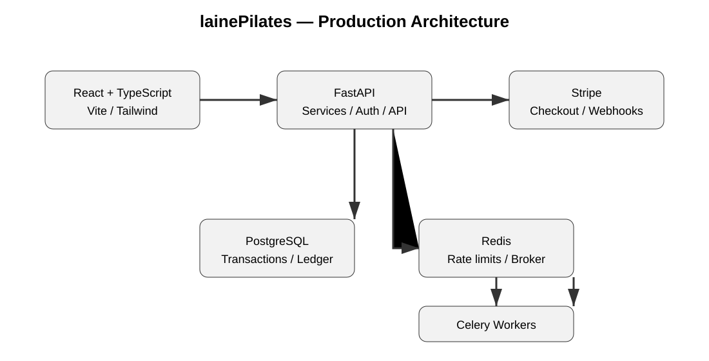

# lainePilates — Production Engineering Showcase

Full-stack booking and payments platform built for a real Pilates business.

> **Production source is private.** This public repository is a curated technical showcase of the architecture, engineering decisions and selected sanitized implementation patterns.

> **Project status:** The production application is currently being prepared for launch and is not publicly accessible yet. This repository is a technical showcase of the engineering decisions, architecture and implementation patterns used in the project.

The production application handles real customer accounts, reservations and payment workflows, so the complete source code, infrastructure configuration and production data are intentionally not exposed here.

## What this demonstrates

This project is more than a CRUD booking application. The interesting engineering work is around **business invariants, concurrency, financial state, idempotency, authentication and failure handling**.

| Area | Design |
|---|---|
| Booking concurrency | PostgreSQL pessimistic row locking |
| Credit balance | Append-only ledger rather than mutable balance |
| Credit consumption | FIFO by expiry + typed credit pools |
| Payment webhooks | Signature verification + event deduplication |
| Payment idempotency | Provider event IDs + DB uniqueness |
| Transaction failures | Savepoints + retryable 5xx responses |
| Authentication | JWT + OAuth |
| Session revocation | Per-token JTI denylist + global token version |
| Authorization | Client / Instructor / Admin RBAC + ownership checks |
| Abuse protection | Redis-backed rate limiting |
| Background work | Redis + Celery |
| Testing | pytest + Vitest / Testing Library |
| Delivery | Docker + Nginx + CI/CD |

## Architecture



```text
React + TypeScript
        |
        | HTTPS / JSON
        v
FastAPI API
  routers -> services -> models
        |
   +----+----------------+
   |                     |
   v                     v
PostgreSQL             Redis
transactions            rate limits
locking                 Celery broker
ledger                  token revocation
                           |
                           v
                     Celery workers
                     emails / jobs

FastAPI <---- signed webhooks ----> Stripe
```

## Stack

- **Backend:** Python 3.11+, FastAPI, SQLAlchemy 2, Alembic
- **Database:** PostgreSQL
- **Frontend:** React, TypeScript, Vite, Tailwind CSS
- **Async / coordination:** Redis, Celery
- **Payments:** Stripe Checkout + signed webhooks
- **Authentication:** JWT + OAuth
- **Testing:** pytest, Vitest, Testing Library
- **Infrastructure:** Docker, Nginx, CI/CD

## Engineering deep dives

- [Architecture](docs/architecture.md) — application layers, dependencies and deployment shape
- [Booking concurrency](docs/booking-concurrency.md) — preventing overbooking under concurrent requests
- [Payments](docs/payments.md) — Stripe webhook verification, idempotency and failure handling
- [Authentication](docs/authentication.md) — JWT revocation, RBAC and rate limiting
- [Testing](docs/testing.md) — business-focused automated testing strategy
- [Async processing](docs/async-processing.md) — Celery jobs and post-transaction notifications

## Selected implementation examples

The examples are deliberately **adapted excerpts**, not copies of private production files.

- [Reservation locking](examples/booking/reservation_service.py)
- [Payment provider abstraction](examples/payments/provider_abstraction.py)
- [Webhook processing](examples/payments/webhook_handler.py)
- [Credit ledger](examples/credits/credit_ledger.py)
- [JWT session revocation](examples/auth/token_revocation.py)
- [Rate limiting](examples/security/rate_limit.py)
- [Async Celery task](examples/async/celery_task.py)
- [Business-rule tests](examples/testing/reservation_rules_test.py)

## Credit ledger

Credits are managed with an **append-only ledger** instead of a mutable balance.

Each purchase has its own credit lot and expiration date. Reservations consume credits from that lot, and cancellations return the credit to the **same lot**, so the original expiration is preserved.

For example:

```text
Purchase: 10 credits, expires Oct 31

purchase  +10
reserve    -1
cancel     +1
```

The cancelled credit is available again, but it still expires on Oct 31. This prevents cancellations from unintentionally extending the lifetime of purchased credits.

Credits are consumed from the lots that expire first, and expired credits are excluded from the available balance.

The ledger provides a simple, auditable history of purchases, usage, refunds and expiry.

## Payment reliability

A payment webhook is treated as an unreliable distributed-system boundary:

1. Read the exact raw request body.
2. Verify the provider signature.
3. Normalize the provider event into an internal DTO.
4. Record/deduplicate the provider event.
5. Process the business transition inside a savepoint.
6. Use database uniqueness as a second idempotency boundary.
7. Return a retryable 5xx when the order is not ready or a transient failure occurs.
8. Commit the business state.
9. Trigger notification work only after the successful commit.

This avoids treating a webhook as a simple payment callback.

## Booking reliability

A booking changes several pieces of state together: class capacity, reservation state and user credit ledger.

The class row is locked before checking capacity. The user's row is locked before a balance-dependent credit operation. These operations are performed inside the same database transaction.

The result is that two concurrent requests cannot both observe the same available seat and successfully consume it.

## Security boundaries

The production application includes:

- JWT access/refresh authentication
- OAuth login
- per-session token revocation through JTI denylisting
- global session invalidation through token versioning
- centralized role authorization
- resource ownership checks
- rate limiting on sensitive endpoints
- signed Stripe webhook verification
- audit logging
- no handling of raw card details

## Testing philosophy

Tests focus on business invariants and failure modes rather than only line coverage.

Examples include booking without credits, exact credit consumption, cancellation/refund rules, forced admin refunds, preventing double charging after reactivation, FIFO credit-lot consumption, expired-credit rejection and webhook idempotency.

CI enforces a minimum backend coverage threshold of **70%**.

## Privacy

This repository intentionally contains no production database, customer information, production payment identifiers, OAuth identifiers, credentials, API keys, environment files, sensitive logs or production exports.

The public repository is therefore safe to share as a technical portfolio while the real application remains private.

---

Built as a real-world production system and documented here as a recruiter-facing engineering case study.
